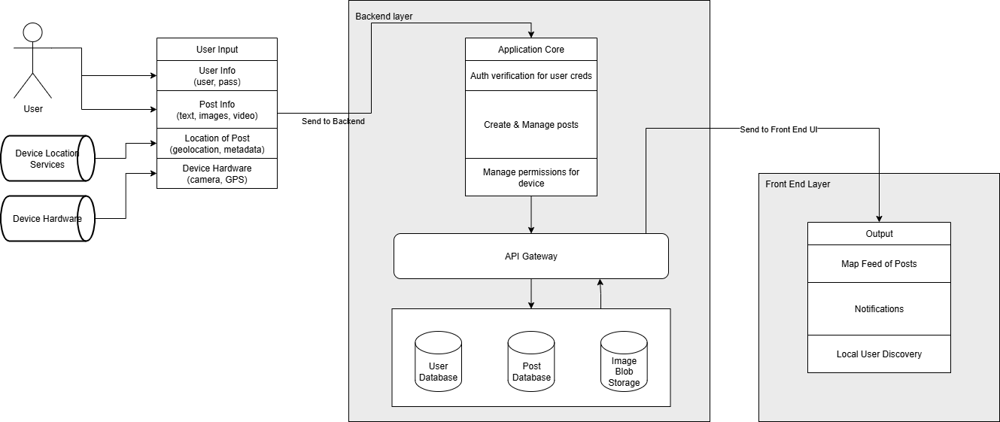
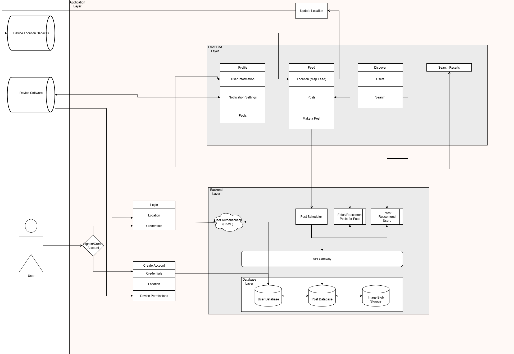

# Senior Design Report
This repository contains extensive documentation outlining our team's work on the Locale project as well as its source files. To navigate to specific sections of the report, use the table of contents below.

## Table of Contents
1. [Team Names & Project Abstract](#team-names--project-abstract)
    1. [Team "Locale"](#team-locale)
    2. [Project Abstract](#project-abstract)
2. [Project Description](#project-description-doc)
3. [User Stories & Design Diagrams](#user-stories--design-diagrams)
    1. [User Stories](#user-stories-doc)
    2. [Design Diagrams](#design-diagrams-doc)
    3. [Diagram Conventions & Components](#diagram-conventions--components)
5. [Project Tasks & Timeline](#project-tasks--timeline)
    1. [Task List](#task-list)
    2. [Timeline](#timeline)
    3. [Effort Matrix](#effort-matrix)
7. [ABET Concerns](#abet-concerns)
8. [PPT Slideshow](#ppt-slideshow)
9. [Self-Assessment Essays](#self-assessment-essays)
10. [Professional Biographies](#professional-biographies)
11. [Budget](#budget)
12. [Appendix](#appendix)

## Team Names & Project Abstract

### Team "Locale"

| Team Member    | Major            | Email                                               |
| :------------: | :--------------: | :-------------------------------------------------: |
| Kevin Chu      | Computer Science | [chukv@mail.uc.edu](mailto:chukv@mail.uc.edu)       |
| Maggie Lyon    | Computer Science | [lyonme@mail.uc.edu](mailto:lyonme@mail.uc.edu)     |
| Kate Schmidlin | Computer Science | [schmi2kj@mail.uc.edu](mailto:schmi2kj@mail.uc.edu) |

| Advisor | Email                                                 |
| :-----: | :---------------------------------------------------: |
| Yu Zhao | [zhao3y3@ucmail.uc.edu](mailto:zhao3y3@ucmail.uc.edu) |

### Project Abstract
TODO: Work in progress.

## Project Description [[doc]](docs/CS5001/Assignment02_TeamFormation_and_ProjectDescription/Locale_ProjectDescription.md)
Locale is a social media application designed to bring real-world interactivity to online media. By leveraging location services within Locale, users are able to "leave" media at a specific location for other local users to discover, visit, and interact with. Locale aims to promote a sense of community for its users by encouraging them to visit posted media, form new relationships with other local users, and participate in discourse. 

## User Stories & Design Diagrams

### User Stories [[doc]](docs/CS5001/Assignment04_UserStories_And_DesignDiagrams/Locale_UserStories.md)

1. As a user, I want to discover media left at nearby locations so that I can explore interesting content while engaging with my local environment.

2. As a user, I want to interact with posts that others have left in my area so that I can participate in local discussions and feel part of the community.

3. As a content creator, I want to post photos, videos, or messages at specific real-world locations so that people visiting those spots can experience my content in context.

4. As a content creator, I want to see how many users have discovered and interacted with my location-based posts so that I can understand my impact and reach.

5. As a user, I want to follow content creators whose location-based posts I enjoy so that I can see more of their content when I explore.

### Design Diagrams [[doc]](https://github.com/adnval/SeniorDesign/blob/main/docs/CS5001/Assignment04_UserStories_And_DesignDiagrams/Locale_DesignDiagrams.pdf)

#### D0 Diagram

#### D1 Diagram

#### D2 Diagram

### Diagram Conventions & Components
TODO: Work in progress.

## Project Tasks & Timeline
TODO: Work in progress.

### Task List
TODO: Work in progress.

### Timeline
TODO: Work in progress.

### Effort Matrix
TODO: Work in progress.

## ABET Concerns
TODO: Work in progress.

## PPT Slideshow
TODO: Work in progress.

## Self-Assessment Essays
- [Kevin Chu](docs/CS5001/Assignment03_TeamContract_And_IndividualCapstoneAssessment/ChuKevin_IndividualCapstoneAssessment.md)
- [Maggie Lyon](docs/CS5001/Assignment03_TeamContract_And_IndividualCapstoneAssessment/LyonMaggie_IndividualCapstoneAssessment.md)
- [Kate Schmidlin](docs/CS5001/Assignment03_TeamContract_And_IndividualCapstoneAssessment/SchmidlinKate_IndividualCapstoneAssessment.md)

## Professional Biographies
- [Kevin Chu](docs/CS5001/Assignment01_ProfessionalBiography/ChuKevin_ProfessionalBiography.md)
- [Maggie Lyon](docs/CS5001/Assignment01_ProfessionalBiography/LyonMaggie_ProfessionalBiography.md)
- [Kate Schmidlin](docs/CS5001/Assignment01_ProfessionalBiography/SchmidlinKate_ProfessionalBiography.md)

## Budget
TODO: Work in progress.

## Appendix
TODO: Work in progress.
