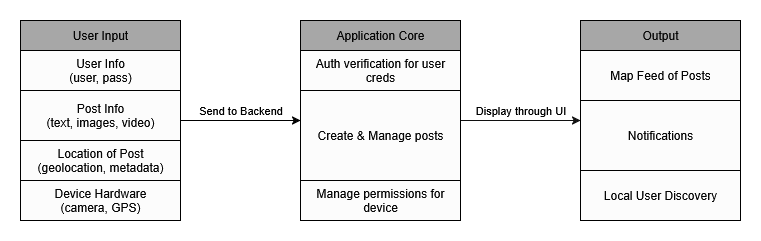

# Senior Design Report
This repository contains extensive documentation outlining our team's work on the Locale project as well as its source files. To navigate to specific sections of the report, use the table of contents below.

## Table of Contents
1. [Team Names & Project Abstract](#team-names--project-abstract)
    1. [Team "Locale"](#team-locale)
    2. [Project Abstract](#project-abstract)
2. [Project Description](#project-description-doc)
3. [User Stories & Design Diagrams](#user-stories--design-diagrams)
    1. [User Stories](#user-stories-doc)
    2. [Design Diagrams](#design-diagrams-doc)
    3. [Diagram Conventions & Components](#diagram-conventions--components)
5. [Project Tasks & Timeline](#project-tasks--timeline)
    1. [Task List](#task-list)
    2. [Timeline](#timeline)
    3. [Effort Matrix](#effort-matrix)
7. [ABET Concerns](#abet-concerns)
8. [PPT Slideshow](#ppt-slideshow)
9. [Self-Assessment Essays](#self-assessment-essays)
10. [Professional Biographies](#professional-biographies)
11. [Budget](#budget)
12. [Appendix](#appendix)

## Team Names & Project Abstract

### Team "Locale"

| Team Member    | Major            | Email                                               |
| :------------: | :--------------: | :-------------------------------------------------: |
| Kevin Chu      | Computer Science | [chukv@mail.uc.edu](mailto:chukv@mail.uc.edu)       |
| Maggie Lyon    | Computer Science | [lyonme@mail.uc.edu](mailto:lyonme@mail.uc.edu)     |
| Kate Schmidlin | Computer Science | [schmi2kj@mail.uc.edu](mailto:schmi2kj@mail.uc.edu) |

| Advisor | Email                                                 |
| :-----: | :---------------------------------------------------: |
| Yu Zhao | [zhao3y3@ucmail.uc.edu](mailto:zhao3y3@ucmail.uc.edu) |

### Project Abstract
Locale is a street art–focused social media platform that connects artists and art enthusiasts through location-based media sharing. Users can “leave” photos, videos, or messages at real-world locations, such as murals, installations, or hidden art spots for others nearby to discover. By combining digital creativity and physical exploration, Locale encourages users to engage with their surroundings by uncovering local art and participating in meaningful community discussions. Artists can share their work in context and track engagement, while users can follow their favorite creators, transforming everyday spaces into interactive galleries that celebrate local creativity and connection.

## Project Description [[doc]](docs/CS5001/Assignment02_TeamFormation_and_ProjectDescription/Locale_ProjectDescription.md)
Locale is a social media application designed to bring real-world interactivity to online media. By leveraging location services within Locale, users are able to "leave" media at a specific location for other local users to discover, visit, and interact with. Locale aims to promote a sense of community for its users by encouraging them to visit posted media, form new relationships with other local users, and participate in discourse. 

## User Stories & Design Diagrams

### User Stories [[doc]](docs/CS5001/Assignment04_UserStories_And_DesignDiagrams/Locale_UserStories.md)

1. As a user, I want to discover media left at nearby locations so that I can explore interesting content while engaging with my local environment.

2. As a user, I want to interact with posts that others have left in my area so that I can participate in local discussions and feel part of the community.

3. As a content creator, I want to post photos, videos, or messages at specific real-world locations so that people visiting those spots can experience my content in context.

4. As a content creator, I want to see how many users have discovered and interacted with my location-based posts so that I can understand my impact and reach.

5. As a user, I want to follow content creators whose location-based posts I enjoy so that I can see more of their content when I explore.

### Design Diagrams [[doc]](https://github.com/adnval/SeniorDesign/blob/main/docs/CS5001/Assignment04_UserStories_And_DesignDiagrams/Locale_DesignDiagrams.pdf)

#### D0 Diagram

#### D1 Diagram

#### D2 Diagram

### Diagram Conventions & Components
TODO: Work in progress.

## Project Tasks & Timeline
TODO: Work in progress.

### Task List
The following table outlines tasks required for the successful completion of locale as well as their assignee. 

| Task                                                                                              | Assignee |
|---------------------------------------------------------------------------------------------------|----------|
| Research Front End framework options                                                              | Kate     |
| Research data storage options. Chosen database must accommodate text, image, and location data    | Kevin    |
| Choose an ORM to interact with backend                                                            | Kevin    |
| Develop UI mockups                                                                                | Kate     |
| Create repository from boilerplate front end/backend code based on chosen frameworks              | Maggie   |
| Design visual branding for application                                                            | Kate     |
| Research & develop API call to device hardware to fetch device information                        | Kevin    |
| Develop a SAML 2FA system for user authentication                                                 | Maggie   |
| Design database schema for posts, users, and locations                                            | Maggie   |
| Develop post scheduler to map posts to database using ORM                                         | Maggie   |
| Develop algorithm for recommending posts to users                                                 | Kevin    |
| Develop and refine user interface based on UI mockups                                             | Maggie   |
| Create content for application (wording, FAQ, notifications, etc.)                                | Kate     |
| Integrate existing search tools to query for posts or users                                       | Kate     |
| Research 3D engine for AR image viewing in map feed                                               | Kevin    |
| Write base queries/mutations to fetch user/post data from database using database schema          | Maggie   |
| Recruit beta testers                                                                               | Kate     |
| Populate database with test users and posts                                                        | Maggie   |
| **Total Tasks**                                                                                   | **18**   |

### Timeline
The following table organizes tasks developed in the task list by related milestone. For each task, an expected time frame is defined. Milestones are marked as complete at the completion of the last associated task. 

| Milestone | Start      | End        | Task                                   | Assignee | Time Frame              | Notes                           |
|----------|------------|------------|----------------------------------------|----------|--------------------------|----------------------------------|
| 1        | 10/2/25    | 11/1/25    | Research Front End framework options   | Kate     | 10/2/25 – 10/16/25       | Done early                       |
| 1        | 10/2/25    | 11/1/25    | Research data storage options          | Kevin    | 10/16/25 – 10/20/25      | Done before ORM selection        |
| 1        | 10/2/25    | 11/1/25    | Choose an ORM                          | Kevin    | 10/20/25 – 10/25/25      | Requires DB research             |
| 1        | 10/2/25    | 11/1/25    | Create repo from boilerplate code      | Maggie   | 10/25/25 – 11/1/25       | Setup step                       |
| 2        | 11/1/25    | 12/6/25    | Develop UI mockups                     | Kate     | 11/1/25 – 11/10/25       | Input to UI implementation       |
| 2        | 11/1/25    | 12/6/25    | Design visual branding                 | Kate     | 11/10/25 – 12/20/25      | Can overlap with mockups         |
| 2        | 11/1/25    | 12/6/25    | Create content (FAQ, wording, etc.)    | Kate     | 11/20/25 – 11/25/25      | Text assets for the app          |
| 2        | 11/1/25    | 12/6/25    | Research 3D engine for AR image viewing| Kevin    | 11/25/25 – 12/6/25       | Independent                       |
| 3        | 12/6/25    | 1/20/26    | Design database schema                 | Maggie   | 1/6/26 – 1/20/26         | Needs ORM                         |
| 4        | 1/20/26    | 3/7/26     | Research & develop device API          | Kevin    | 1/20/26 – 1/24/26        | Hardware integration              |
| 4        | 1/20/26    | 3/7/26     | Develop SAML 2FA auth system           | Maggie   | 1/24/26 – 2/7/26         | Security-critical                 |
| 4        | 1/20/26    | 3/7/26     | Develop post scheduler using ORM       | Maggie   | 2/7/26 – 2/21/26         | Requires schema + ORM            |
| 4        | 1/20/26    | 3/7/26     | Develop recommendation algorithm       | Kevin    | 2/21/26 – 2/28/26        | Logic-based, backend only        |
| 4        | 1/20/26    | 3/7/26     | Develop/refine user interface          | Maggie   | 2/28/26 – 3/2/26         | Bigger chunk of time             |
| 4        | 1/20/26    | 3/7/26     | Write DB queries/mutations             | Maggie   | 3/2/26 – 3/4/26          | Needs schema + scheduler done    |
| 4        | 1/20/26    | 3/7/26     | Integrate existing search tools        | Kate     | 3/4/26 – 3/7/26          | Based on existing solutions       |
| 5        | 3/7/26     | 4/17/26    | Recruit beta testers                   | Kate     | 3/7/26 – 3/14/26         | Prep for testing                  |
| 5        | 3/7/26     | 4/17/26    | Populate DB with test users/posts      | Maggie   | 3/14/26 – 3/28/26        | Pre-QA step                       |
| 5        | 3/7/26     | 4/17/26    | Buffer / Final Debugging & QA          | All      | 3/28/26 – 4/17/26        | Final stretch                     |

### Effort Matrix
The following matrix breaks down hours estimates for each task defined above. For each task, an administrative margin of 10% is added to account for documentation, project management, etc. A 20% reserve margin is also applied to account for unexpected circumstances.  

| Task                         | Assignee | Raw Effort (hrs) | + Admin (10%) | + Margin (20%) | Total (hrs) |
|------------------------------|----------|------------------|---------------|----------------|-------------|
| Research FE framework options | Kate     | 4                | 0.4           | 0.8            | 5.2         |
| Research data storage options | Kevin    | 4                | 0.4           | 0.8            | 5.2         |
| Choose an ORM                 | Kevin    | 4                | 0.4           | 0.8            | 5.2         |
| Develop UI mockups            | Kate     | 8                | 0.8           | 1.6            | 10.4        |
| Design visual branding        | Kate     | 8                | 0.8           | 1.6            | 10.4        |
| Create content                | Kate     | 6                | 0.6           | 1.2            | 7.8         |
| Research 3D engine            | Kevin    | 4                | 0.4           | 0.8            | 5.2         |
| Create boilerplate repo       | Maggie   | 4                | 0.4           | 0.8            | 5.2         |
| Design DB schema              | Maggie   | 10               | 1             | 2              | 13          |
| Device info API               | Kevin    | 10               | 1             | 2              | 13          |
| SAML 2FA system               | Maggie   | 12               | 1.2           | 2.4            | 15.6        |
| Post scheduler                | Maggie   | 12               | 1.2           | 2.4            | 15.6        |
| Recommendation algorithm      | Kevin    | 16               | 1.6           | 3.2            | 20.8        |
| UI implementation             | Maggie   | 16               | 1.6           | 3.2            | 20.8        |
| DB queries/mutations          | Maggie   | 8                | 0.8           | 1.6            | 10.4        |
| Integrate search tools        | Kate     | 12               | 1.2           | 2.4            | 15.6        |
| Recruit beta testers          | Kate     | 4                | 0.4           | 0.8            | 5.2         |
| Populate DB with test data    | Maggie   | 2                | 0.2           | 0.4            | 2.6         |
| QA & Debugging                | All      | 12               | 1.2           | 2.4            | 15.6        |
| **TOTALS**                    | —        | **156**          | **15.6**      | **31.2**       | **202.8**   |

## ABET Concerns
TODO: Work in progress.

## PPT Slideshow
TODO: Work in progress.

## Self-Assessment Essays
- [Kevin Chu](docs/CS5001/Assignment03_TeamContract_And_IndividualCapstoneAssessment/ChuKevin_IndividualCapstoneAssessment.md)
- [Maggie Lyon](docs/CS5001/Assignment03_TeamContract_And_IndividualCapstoneAssessment/LyonMaggie_IndividualCapstoneAssessment.md)
- [Kate Schmidlin](docs/CS5001/Assignment03_TeamContract_And_IndividualCapstoneAssessment/SchmidlinKate_IndividualCapstoneAssessment.md)

## Professional Biographies
- [Kevin Chu](docs/CS5001/Assignment01_ProfessionalBiography/ChuKevin_ProfessionalBiography.md)
- [Maggie Lyon](docs/CS5001/Assignment01_ProfessionalBiography/LyonMaggie_ProfessionalBiography.md)
- [Kate Schmidlin](docs/CS5001/Assignment01_ProfessionalBiography/SchmidlinKate_ProfessionalBiography.md)

## Budget
No budget information to show at this point. 

## Appendix
TODO: Work in progress.
