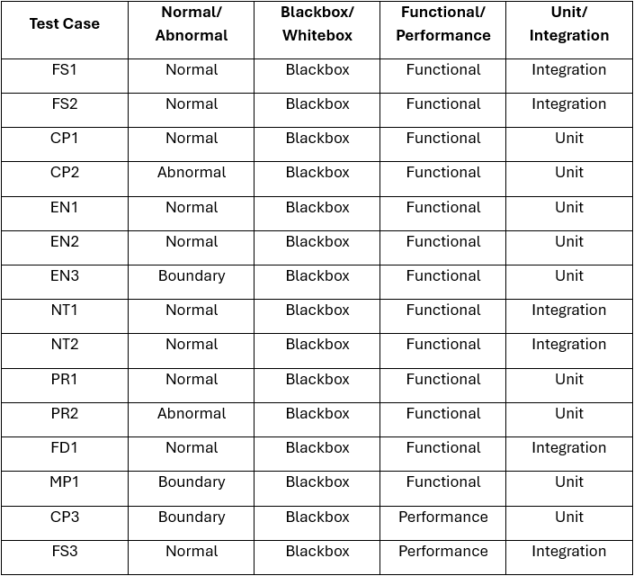

# Senior Design Spring Report
This directory contains extensive documentation outlining our team's work on the Locale project during the spring semester. To navigate to specific sections of the report, use the table of contents below.

## Table of Contents
1. [Team Locale](#team-locale)
2. [Project Description](#project-description)
3. [Test Plans & Results](#test-plans--results-doc)
    1. [Test Plans](#test-plans)
    2. [Test Case Matrix](#test-case-matrix)
4. [User Manual & FAQ](#user-manual--faq)
    1. [User Manual](#user-manual)
    2. [FAQ](#faq)
5. [Final Design Presentation](#final-design-presentation)
6. [Expo Poster](#expo-poster)
7. [Assessments](#assessments)
    1. [Mid-Semester Individual Assessments](#mid-semester-individual-assessments)
    2. [Final-Semester Individual Assessments](#final-semester-individual-assessments)
8. [Summary of Hours & Justification](#summary-of-hours--justification)
9. [Summary of Expenses](#summary-of-expenses)
10. [Appendix](#appendix)

## Team "Locale"
| Team Member | Major | Email |
| :-: | :-: | :-: |
| Kevin Chu | Computer Science | [chukv@mail.uc.edu](mailto:chukv@mail.uc.edu) |
| Maggie Lyon | Computer Science | [lyonme@mail.uc.edu](mailto:lyonme@mail.uc.edu) |
| Kate Schmidlin | Computer Science | [schmi2kj@mail.uc.edu](mailto:schmi2kj@mail.uc.edu) |

| Advisor | Email |
| :-: | :-: |
| Yu Zhao | [zhao3y3@ucmail.uc.edu](mailto:zhao3y3@ucmail.uc.edu) |

## Project Description
Locale is a location-based social media platform where users post media tied to specific places. By encouraging nearby users to visit and engage with content in person, it fosters real-world interaction. The app supports creative uses such as virtual art galleries, connecting communities through shared, location-driven experiences.

## Test Plans & Results [[doc]](Assignment01_TestPlan/Locale_TestPlan.pdf)

### Test Plans

#### FS1.1 Feed Loading Test
FS1.2 Purpose: Verify nearby posts are displayed

FS1.3 Description: Open feed page and load posts based on user location

FS1.4 Inputs: User location, existing posts

FS1.5 Expected Outputs: Only nearby posts appear in feed

FS1.6 Type: Normal

FS1.7 Method: Blackbox

FS1.8 Category: Functional

FS1.9 Level: Integration

FS1.10 Results: Nearby posts were correctly displayed based on user location. No distant posts appeared.

#### FS2.1 Map Pin Accuracy Test
FS2.2 Purpose: Ensure posts are mapped correctly

FS2.3 Description: View map and compare post locations to pins

FS2.4 Inputs: Posts with GPS coordinates

FS2.5 Expected Outputs: Pins accurately reflect post locations

FS2.6 Type: Normal

FS2.7 Method: Blackbox

FS2.8 Category: Functional

FS2.9 Level: Integration

FS2.10 Results: All pins matched their corresponding GPS coordinates with no discrepancies.

#### CP1.1 Create Post Test
CP1.2 Purpose: Validate post creation

CP1.3 Description: Take photo and upload with location

CP1.4 Inputs: Image, GPS coordinates

CP1.5 Expected Outputs: Post appears on feed and map

CP1.6 Type: Normal

CP1.7 Method: Blackbox

CP1.8 Category: Functional

CP1.9 Level: Unit

CP1.10 Results: Post successfully appeared on both feed and map with correct location.

#### CP2.1 Create Post Without Location
CP2.2 Purpose: Handle missing GPS data

CP2.3 Description: Attempt to upload post with location disabled

CP2.4 Inputs: Image without GPS

CP2.5 Expected Outputs: Error or fallback behavior

CP2.6 Type: Abnormal

CP2.7 Method: Blackbox

CP2.8 Category: Functional

CP2.9 Level: Unit

CP2.10 Results: System prevented upload and displayed appropriate error message.

#### EN1.1 Like Post Test
EN1.2 Purpose: Verify like functionality

EN1.3 Description: User likes a post

EN1.4 Inputs: Post ID, user action

EN1.5 Expected Outputs: Like count increments

EN1.6 Type: Normal

EN1.7 Method: Blackbox

EN1.8 Category: Functional

EN1.9 Level: Unit

EN1.10 Results: Like count incremented correctly and persisted after refresh.

#### EN2.1 Dislike Post Test
EN2.2 Purpose: Verify dislike functionality

EN2.3 Description: User dislikes a post

EN2.4 Inputs: Post ID, user action

EN2.5 Expected Outputs: Dislike count increments

EN2.6 Type: Normal

EN2.7 Method: Blackbox

EN2.8 Category: Functional

EN2.9 Level: Unit

EN2.10 Results: Dislike count incremented correctly and updated in real time.

#### EN3.1 Duplicate Reaction Prevention
EN3.2 Purpose: Prevent multiple likes/dislikes

EN3.3 Description: User attempts to like multiple times

EN3.4 Inputs: Repeated user action

EN3.5 Expected Outputs: Only one reaction counted

EN3.6 Type: Boundary

EN3.7 Method: Blackbox

EN3.8 Category: Functional

EN3.9 Level: Unit

EN3.10 Results: System restricted duplicate reactions; only one like was recorded.

#### NT1.1 Notification Trigger Test
NT1.2 Purpose: Verify notification generation

NT1.3 Description: Like a post and check notifications

NT1.4 Inputs: Like event

NT1.5 Expected Outputs: Notification sent to post owner

NT1.6 Type: Normal

NT1.7 Method: Blackbox

NT1.8 Category: Functional

NT1.9 Level: Integration

NT1.10 Results: Notification was successfully generated and delivered to the post owner.

#### NT2.1 Notification Accuracy
NT2.2 Purpose: Ensure correct notification content

NT2.3 Description: Trigger multiple events

NT2.4 Inputs: Likes, follows

NT2.5 Expected Outputs: Correct messages displayed

NT2.6 Type: Normal

NT2.7 Method: Blackbox

NT2.8 Category: Functional

NT2.9 Level: Integration

NT2.10 Results: Notifications displayed correct user actions and timestamps.

#### PR1.1 Profile Edit Test
PR1.2 Purpose: Validate profile updates

PR1.3 Description: Edit username/bio

PR1.4 Inputs: New profile data

PR1.5 Expected Outputs: Updated profile saved and displayed

PR1.6 Type: Normal

PR1.7 Method: Blackbox

PR1.8 Category: Functional

PR1.9 Level: Unit

PR1.10 Results: Profile updates were saved and reflected immediately.

#### PR2.1 Invalid Profile Update
PR2.2 Purpose: Handle invalid input

PR2.3 Description: Submit empty or invalid fields

PR2.4 Inputs: Invalid profile data

PR2.5 Expected Outputs: Error message shown

PR2.6 Type: Abnormal

PR2.7 Method: Blackbox

PR2.8 Category: Functional

PR2.9 Level: Unit

PR2.10 Results: System rejected invalid input and displayed validation errors.

#### FD1.1 Feed Refresh Test
FD1.2 Purpose: Ensure feed updates dynamically

FD1.3 Description: Refresh feed after new post

FD1.4 Inputs: New nearby post

FD1.5 Expected Outputs: New post appears

FD1.6 Type: Normal

FD1.7 Method: Blackbox

FD1.8 Category: Functional

FD1.9 Level: Integration

FD1.10 Results: Newly created post appeared immediately after refresh.

#### MP1.1 Map Zoom Boundary Test
MP1.2 Purpose: Validate map scaling

MP1.3 Description: Zoom in/out on map

MP1.4 Inputs: Zoom levels

MP1.5 Expected Outputs: Pins remain accurate and visible

MP1.6 Type: Boundary

MP1.7 Method: Blackbox

MP1.8 Category: Functional

MP1.9 Level: Unit

MP1.10 Results: Map scaling maintained correct pin positioning at all zoom levels.

#### CP3.1 Large Image Upload
CP3.2 Purpose: Test upload limits

CP3.3 Description: Upload very large image

CP3.4 Inputs: High-resolution image

CP3.5 Expected Outputs: Image handled or rejected gracefully

CP3.6 Type: Boundary

CP3.7 Method: Blackbox

CP3.8 Category: Performance

CP3.9 Level: Unit

CP3.10 Results: System either compressed the image successfully or rejected it with a clear message.

#### FS3.1 High Load Feed Test
FS3.2 Purpose: Test system under load

FS3.3 Description: Simulate many posts/users

FS3.4 Inputs: High traffic simulation

FS3.5 Expected Outputs: System remains responsive

FS3.6 Type: Normal

FS3.7 Method: Blackbox

FS3.8 Category: Performance

FS3.9 Level: Integration

FS3.10 Results: System remained responsive with minimal latency under simulated load.

### Test Case Matrix

## User Manual & FAQ

### User Manual
WIP

### FAQ
WIP

## Final Design Presentation
- [Final-Semester Design Presentation](https://mailuc-my.sharepoint.com/:p:/g/personal/lyonme_mail_uc_edu/IQCSDKL6nBUBSqwI1cz6wPzjAZPoA5UI1HqX76nMZ9OiyTs?e=mhIy4M)

## Expo Poster

## Assessments

### Mid-Semester Individual Assessments
- [Kevin Chu](../CS5001/Assignment03_TeamContract_IndividualCapstoneAssessment/ChuKevin_IndividualCapstoneAssessment.md)
- [Maggie Lyon](../CS5001/Assignment03_TeamContract_IndividualCapstoneAssessment/LyonMaggie_IndividualCapstoneAssessment.md)
- [Kate Schmidlin](../CS5001/Assignment03_TeamContract_IndividualCapstoneAssessment/SchmidlinKate_IndividualCapstoneAssessment.md)

### Final-Semester Individual Assessments
- [Kevin Chu](Assignment06_SelfAssessments/ChuKevin_SelfAssessment.md)
- [Maggie Lyon](Assignment06_SelfAssessments/LyonMaggie_SelfAssessment.md)
- [Kate Schmidlin](Assignment06_SelfAssessments/SchmidlinKate_SelfAssessment.md)

## Summary of Hours & Justification
WIP

## Summary of Expenses
No budget information to show at this point. 

## Appendix
Work in progress. No major project updates to show for now.
